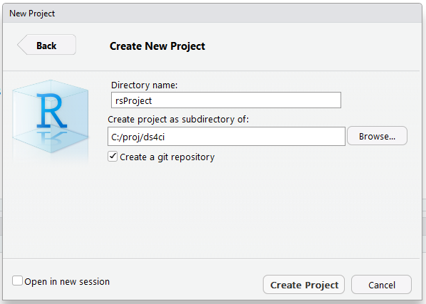

RStudio Projects
========================================================
autosize: true
## Oakland R Beginners

Jim Porzak

March 6, 2017


What We Will Cover
========================================================

- Motivation
- Directory Structure
- Creating a New Project
- Tying in Git & GitHub
- Pure R vs R Notebooks
- Wrap-up

Motivation
========================================================
type: section

* Keep all project data together
* Let RStudio handle working directory/folder location
  * Then use relative paths
  * For portable projects!
* Use Git/GitHub for backup & version control
  * Not just for R code!
* Stay tuned for creating packages

Directory Structure
========================================================
type: section

Simple Case - Just a few projects
========================================================
* proj
  * My1stProject
      * R
      * [SQL]
      * [DataIn]
      * [DateOut]
      * [Results]
      * [Background]
  * My2ndProject
      * ...

[indicates optional folder]

When You Have Many Clients
========================================================
* proj
  * Client1
      * [DataIn]
      * [DataOut]
      * C1Proj1
          * R
          * ...
      * C1Proj2
          * ...
  * Client2
      * ...

When You Have a Major Client
========================================================
* proj
  * Client1
      * C1FirstMajorProj
          * C1FMP_Subproj1
              * R
              * ...
          * C1FMP_Subproj2 (could be a package!)
              * ...
      * C1SecondMajorProj
          * ...
  * Client2

Setting-up a New Project
========================================================
type: section

Using this project as the example.

Creating the Project in RStudio
========================================================
Once basic directory structure is set up...




Tying in Git & GitHub
========================================================
type: section

Gotcha: Git/GitHub repo == Single RStudo project

Getting Git & GitHub
========================================================

To install Git see the R Studio article:

https://support.rstudio.com/hc/en-us/articles/200532077

If you need a GitHub account, sign up at https://github.com

Initial Git Commit
========================================================


Make a New Repo in Your GitHub
========================================================


Copy Commands to Execuite in Local Shell
========================================================


Run Commands to Link & Initialize GitHub Repo
========================================================


Resulting GitHub Repo
========================================================


Write README in R Markdown
========================================================
```
---
title: "README"
output: github_document
---
## rsProject

Is both an example and a presentation of the basics of
setting up a *project* in RStudio.
. . .
```
Save in the project root as README.Rmd and knit:


Pure R vs R Notebooks
========================================================
type: section

Wrap-up
========================================================
type: section


Slide With Code
========================================================


```r
summary(cars)
```

```
     speed           dist       
 Min.   : 4.0   Min.   :  2.00  
 1st Qu.:12.0   1st Qu.: 26.00  
 Median :15.0   Median : 36.00  
 Mean   :15.4   Mean   : 42.98  
 3rd Qu.:19.0   3rd Qu.: 56.00  
 Max.   :25.0   Max.   :120.00  
```

Slide With Plot
========================================================


